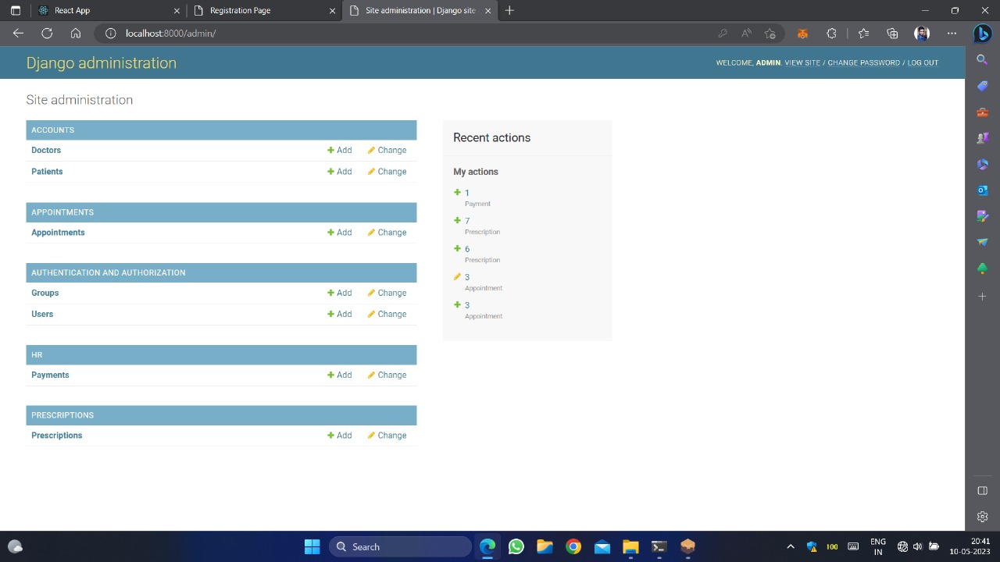
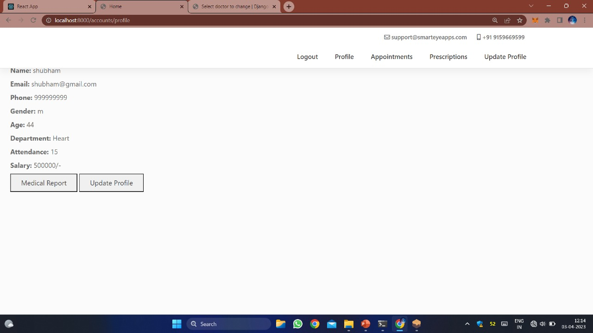
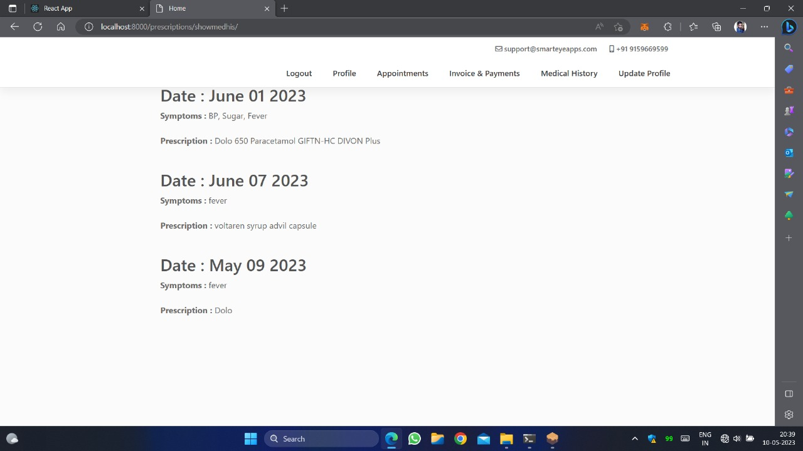
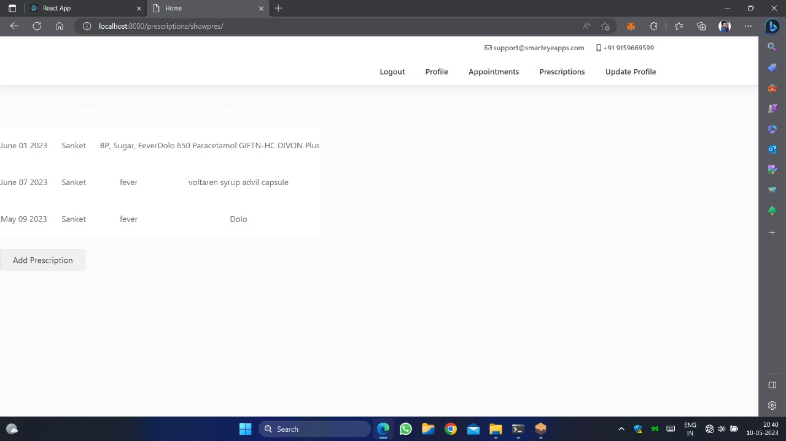
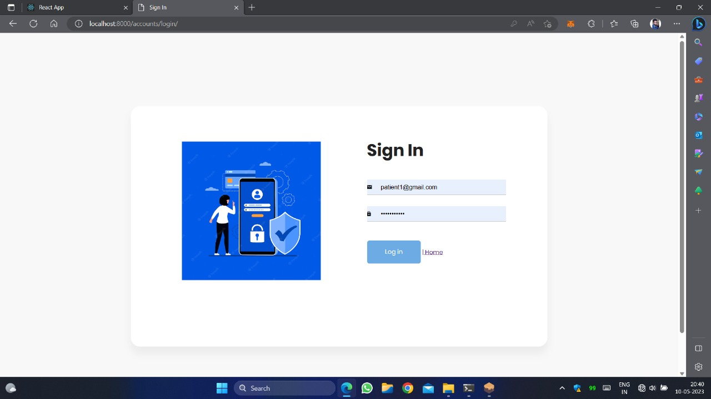
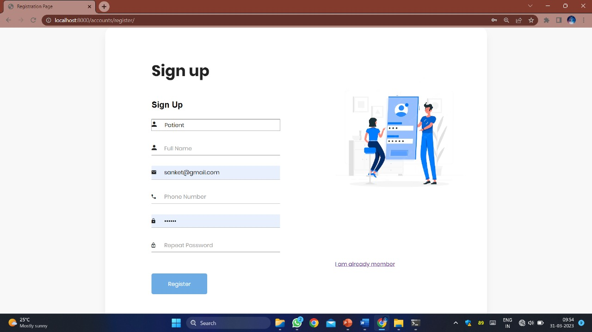
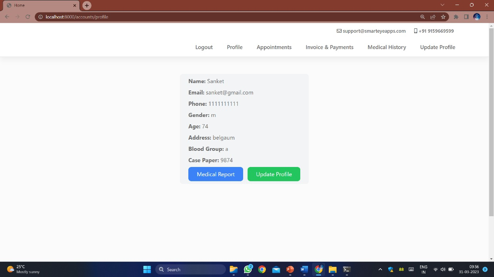

# Medical Data Assistant with Blockchain and Accident Detection  

## Overview  
The **Medical Data Assistant with Blockchain and Accident Detection** is a **comprehensive healthcare management system** that integrates **Django, Blockchain, and AI-powered accident detection**. This project ensures **secure medical record management**, **blockchain-based user authentication**, **hospital administration**, and **real-time driver drowsiness detection** to enhance patient care and road safety.  

---

## Key Features  

### 1. Blockchain-Based User Authentication  
- Users authenticate securely via **MetaMask and Ganache**.  
- Ethereum transactions validate and verify user identity before granting access.  
- Ensures **tamper-proof medical data storage** and prevents unauthorized access.  

### 2. Hospital Management System  
- **Admin**: Manage hospitals, doctors, and patient records using **Django CRUD operations**.  
- **Doctors**: View and update **patient records securely** through the platform.  
- **Users/Patients**: Manage **personal medical data**, access **healthcare services**, and interact with doctors.  

### 3. AI-Powered Drowsiness Detection  
- Utilizes **OpenCV and Haarcascade** for **real-time facial landmark monitoring**.  
- Detects **eye closure, yawning, and head tilting** to identify driver fatigue.  
- Issues **instant alerts** to warn drivers or notify emergency contacts in case of drowsiness.  

---

## Tech Stack  

| Tech | Purpose |
|------|---------|
| **Django** | Backend Framework |
| **SQLite** | Database |
| **Bootstrap** | UI Styling |
| **HTML, CSS, JS** | Frontend |
| **MetaMask, Ganache** | Blockchain Authentication |
| **OpenCV** | Drowsiness Detection |
| **REST API** | Data Communication |

---

## Installation Guide  

### Prerequisites  
- **Python 3.x**  
- **Django**  
- **OpenCV**  
- **MetaMask Browser Extension**  
- **Ganache for Ethereum Transactions**  

### Steps to Run  

1. **Clone the Repository**  

   ```sh
   git clone https://github.com/your-repo/medical-blockchain.git
   cd medical-blockchain
   ```

2. **Install Dependencies**  

   ```sh
   pip install -r requirements.txt
   ```

3. **Run Migrations**  

   ```sh
   python manage.py migrate
   ```

4. **Start the Django Server**  

   ```sh
   python manage.py runserver
   ```

5. **Set up Blockchain Authentication**  
   - Open **Ganache**.  
   - Connect **MetaMask** to the Ganache network.  
   - Register/Login using MetaMask.  

6. **Run Drowsiness Detection**  

   ```sh
   python detect_drowsiness.py
   ```

---

## Screenshots  

### 1. Admin Dashboard  
  

### 2. Doctor Profile  
  

### 3. Prescription Creation  
  

### 4. Prescription List  
  

### 5. Sign In Page  
  

### 6. Sign Up Page  
  

### 7. User Profile  
  

---

# React App Setup and Run Guide  

This guide provides step-by-step instructions to set up and run a React application using **Yarn** and **npm**.  

---

## Prerequisites  
- **Node.js** (Download from [nodejs.org](https://nodejs.org/))  
- **Yarn (optional)** (Install using `npm install -g yarn`)  
- **React installed** (or create a new React app using `npx create-react-app my-app`)  

---

## Running the React App with Yarn  

1. **Navigate to your React project folder**  

   ```sh
   cd your-react-app
   ```

2. **Install dependencies**  

   ```sh
   yarn install
   ```

3. **Start the development server**  

   ```sh
   yarn start
   ```

4. **Build for production (optional)**  

   ```sh
   yarn build
   ```

---

## Running the React App with npm  

1. **Navigate to your React project folder**  

   ```sh
   cd your-react-app
   ```

2. **Install dependencies**  

   ```sh
   npm install
   ```

3. **Start the development server**  

   ```sh
   npm start
   ```

4. **Build for production (optional)**  

   ```sh
   npm run build
   ```

---

## Notes  
- The app will run on **http://localhost:3000** by default.  
- If you face permission issues while installing dependencies, try running the commands with `sudo` (Linux/macOS).  
- To switch between `npm` and `yarn`, ensure the `node_modules` folder is cleared (`rm -rf node_modules && rm package-lock.json` before switching).  

---

## Contributors  
- **Rohan Shedage** - [GitHub Profile](https://github.com/Rohan-Shedage)  
- **Sanket Jadhav** - [GitHub Profile](https://github.com/sanket2401)  

